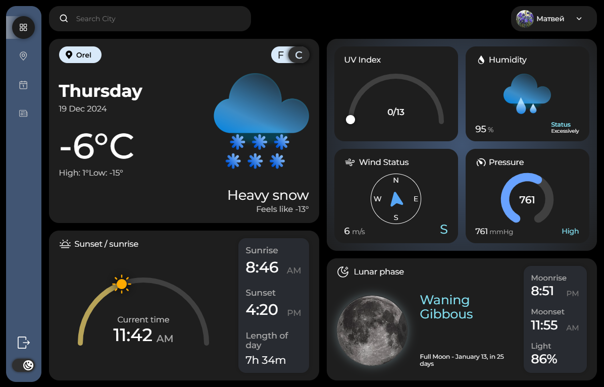

<h1 align="center">Forecast</h1>

<div align="center" id="top"> 
  
</div>
&#xa0;

<p align="center">
  

  

  

  

  
</p>

<p align="center">
  <a href="#dart-about">About</a> &#xa0; | &#xa0; 
  <a href="#sparkles-features">Features</a> &#xa0; | &#xa0;
  <a href="#rocket-technologies">Technologies</a> &#xa0; | &#xa0;
  <a href="#white_check_mark-requirements">Requirements</a> &#xa0; | &#xa0;
  <a href="#checkered_flag-starting">Starting</a> &#xa0; | &#xa0;
  <a href="#memo-license">License</a> &#xa0; | &#xa0;
  <a href="https://github.com/matmon12" target="_blank">Author</a>
</p>

<br>

## :dart: About

The site is an educational project. It includes the current weather display,
hourly forecast for 3 days, a page with weather news and more. There is an authentication system, several roles. For certain roles, a CRUD table for managing posts is implemented. Firebase was used in the project.

## :sparkles: Features

:heavy_check_mark: Authentication via email and password;\
:heavy_check_mark: Light and dark themes;\
:heavy_check_mark: Division of access rights: guest, user, moderator, administrator;\
:heavy_check_mark: Weather display animations;\
:heavy_check_mark: Dynamic breadcrumbs;\
:heavy_check_mark: Different types of graphs, dynamic data change for them;\
:heavy_check_mark: Post card styling: dynamic background color definition based on priority image colors and text color on this background;\
:heavy_check_mark: Post rating system;\
:heavy_check_mark: CRUD table for managing posts, filters and sorting, ability to reset filters and export posts;\
:heavy_check_mark: Uploading images for posts and user profile;\
:heavy_check_mark: Validation;\
:heavy_check_mark: Text editor for writing text for posts;\
:heavy_check_mark: Choose background and text colors in the editor;\
:heavy_check_mark: View images in their original size, ability to interact with them;\
:heavy_check_mark: Editing user information;\
:heavy_check_mark: Getting weather for the entered city;\
:heavy_check_mark: UI component for displaying the position of the sun in the sky;\
:heavy_check_mark: Selecting units of measurement;\
:heavy_check_mark: Selecting a data set for a table;\
:heavy_check_mark: Autocomplete for city search;\
:heavy_check_mark: Adding a default city;\
:heavy_check_mark: Ability to swap cards on the main page;\
:heavy_check_mark: Adaptive;\
:heavy_check_mark: Internationalization.

## :rocket: Technologies

The following tools were used in this project:

- [Vue](https://vuejs.org/)
- [Firebase](https://console.firebase.google.com/)
- [CASL](https://casl.js.org/v6/en)
- [VueUse](https://vueuse.org/)
- [Chart.js](https://www.chartjs.org/docs/latest/)
- [Pinia](https://pinia.vuejs.org/)
- [Vite](https://vitejs.dev/)
- [PrimeVue](https://primevue.org/)
- [VeeValidate](https://vee-validate.logaretm.com/v4/)
- [VueTelInput](https://iamstevendao.com/vue-tel-input/)
- [Yup](https://github.com/jquense/yup)
- [Pickr](https://simonwep.github.io/pickr/)
- [Quill](https://quilljs.com/)
- [Animejs](https://animejs.com/)
- [Astronomia](https://github.com/commenthol/astronomia)
- [Axios](https://axios-http.com/ru/docs/intro)
- [Lodash.debounce](https://lodash.com/)
- [Rgbaster](https://github.com/briangonzalez/rgbaster.js)
- [Uuid](https://github.com/uuidjs/uuid)
- [Vue-country-flag](https://github.com/ubaldop/vue-country-flag)
- [Vue-resize](https://github.com/Akryum/vue-resize)
- [Vue-router](https://router.vuejs.org/)
- [Vue I18n](https://vue-i18n.intlify.dev/)
- [Swapy](https://swapy.tahazsh.com/)

## :white_check_mark: Requirements

Before starting :checkered_flag:, you need to have [Git](https://git-scm.com) and [Node](https://nodejs.org/en/) installed.

## :checkered_flag: Starting

```bash
# Clone this project
$ git clone https://github.com/matmon12/forecast

# Access
$ cd forecast

# Install dependencies
$ npm install

# Run the project
$ npm run dev

# Compiles and minifies for production
$ npm run build
```

### Vue 3 + Vite

This template should help get you started developing with Vue 3 in Vite. The template uses Vue 3 `<script setup>` SFCs, check out the [script setup docs](https://v3.vuejs.org/api/sfc-script-setup.html#sfc-script-setup) to learn more.

### Recommended IDE Setup

- [VS Code](https://code.visualstudio.com/) + [Volar](https://marketplace.visualstudio.com/items?itemName=Vue.volar) (and disable Vetur) + [TypeScript Vue Plugin (Volar)](https://marketplace.visualstudio.com/items?itemName=Vue.vscode-typescript-vue-plugin).

## :memo: License

This project is under license from MIT. For more details, see the [LICENSE](LICENSE) file.

Made with :heart: by <a href="https://github.com/matmon12" target="_blank">Matmon</a>

&#xa0;

<a href="#top">Back to top</a>
